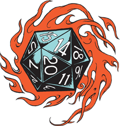

# Club JDR Website



[](https://sonarcloud.io/dashboard?id=notsag_club-jdr.fr)
[](https://github.com/ambv/black)
=======

This website is build with Flask.

## Prerequisites

### Install all requirements :
```
python3 -m pip install -r requirements.txt
```

### Setup the environment variables
Go to [Discord developer portal](https://discord.com/developers/applications/) and create a new application. Go to the OAuth2 tab and gather the client id and secret, then go to the bot tab and get the bot token.

Export these variables to your environment :
```
export DISCORD_CLIENT_ID=<discord-oauth2-client-id>
export DISCORD_CLIENT_SECRET=<discord-oauth2-client-secret>
export DISCORD_BOT_TOKEN=<Discord-bot-token>
export FLASK_AUTH_SECRET=<random-string-for-sessions>
```

### Create needed files & directories

```
mkdir -p website/content website/wiki
echo '{"games":{"a":{"scenarios":[{"title": "AAA","url": "#","description":"xxx"}]},"b":{}}}' > website/storage.json
```

## Run development version

Just run `gunicorn --bind 0.0.0.0:5000 wsgi:app` and go to http://localhost:5000 to get to the local website.

## Run tests

Export environment variables, install `pytest` and run the test suite :
```
python3 -m pip install pytest pytest-cov
python3 -m pytest test --cov website --cov-report xml -o junitxml=junit.xml
```
